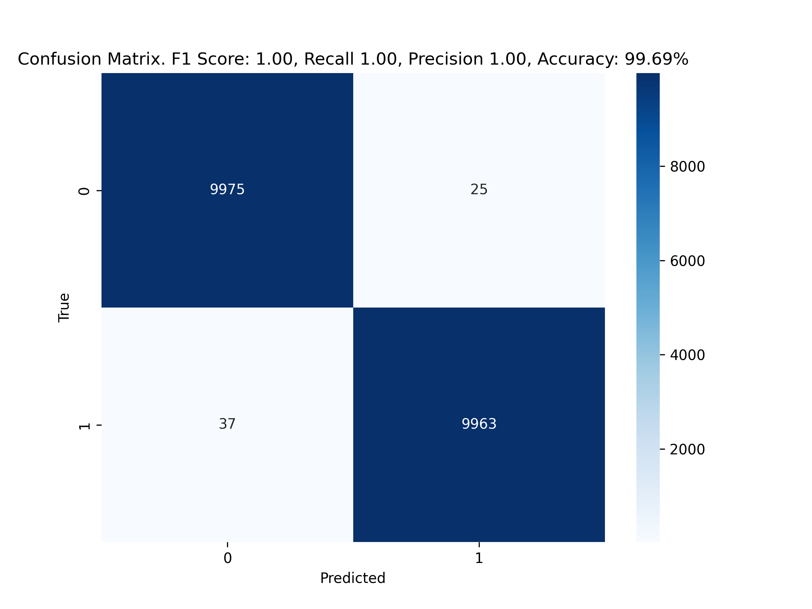

## Code classification

Classification model fine-tuned over `distillery-base-uncased` using HF Transformers tools to classify text as code or English.

It was used `imdb` and `codeparrot\github` datasets.

Python 3.12 required

The weights are available on [HF Hub](https://huggingface.co/anatal/code_english_model).
